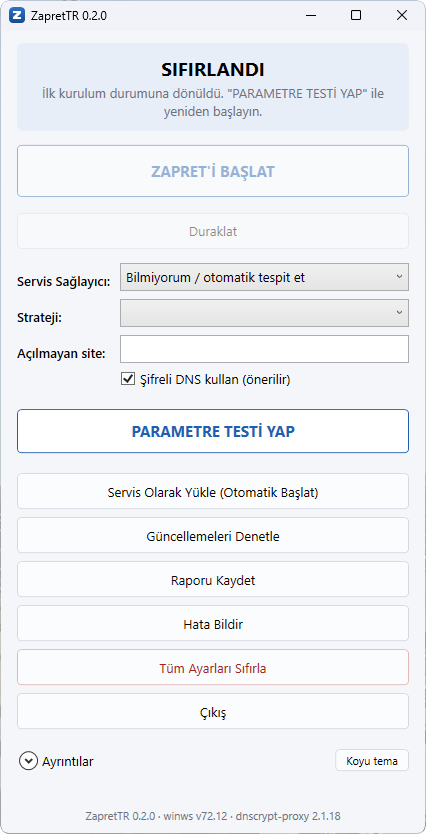
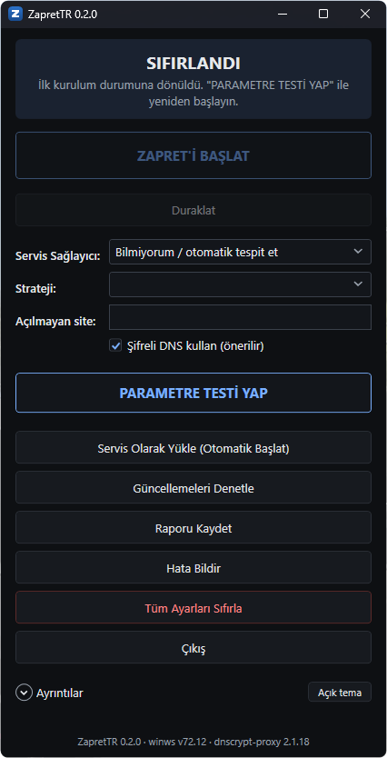

<div align="center">


# ZapretTR

**Türkiye'deki erişim engellerini aşan ayarı sizin hattınızda ölçerek bulan Windows uygulaması.**

[](https://github.com/superuser-d0/zapret-tr/releases/latest)
[](LICENSE)

### [⬇ İndir](https://github.com/superuser-d0/zapret-tr/releases/latest) · [Sorun giderme](docs/SORUN-GIDERME.md) · [Ayrıntılar](README-DETAYLI.md)

&nbsp;&nbsp;

<sub>Açık ve koyu tema</sub>

</div>

---

Bu sayfa yalnızca kurmak ve kullanmak için gerekenleri anlatır. Nasıl çalıştığı, ölçüm
sonuçları ve geliştirme bilgileri [ayrıntılı belgede](README-DETAYLI.md).

**Gereksinim:** Windows 10/11, 64 bit, yönetici yetkisi.

## 1. İndirin

[Son sürüm sayfasından](https://github.com/superuser-d0/zapret-tr/releases/latest)
**`ZapretTR-Setup-<sürüm>.exe`** dosyasını indirin.

> **Tarayıcı indirmeyi bekletebilir.** Microsoft Edge dosyayı indirir ama *"ZapretTR-Setup-…exe
> yaygın olarak indirilmiyor"* (*isn't commonly downloaded*) diyerek bekletir. Bu bir virüs
> uyarısı değil, dosya yeni ve imzasız olduğu için verilen bir itibar uyarısı. İndirilenler
> panelinde dosyanın üzerine gelin → **"…" → Sakla (Keep) → Daha fazla göster (Show more) →
> Yine de sakla (Keep anyway)**. Chrome'da da benzer bir uyarı çıkabilir.

> Aynı sayfadaki `zapret-tr-saha-testi.zip` **size gerekmez**: yalnızca ölçüm yapan bir test
> aracıdır, internetinizi açmaz.

## 2. Kurun

Dosyaya çift tıklayın.

- **"Windows bilgisayarınızı korudu"** uyarısı çıkarsa: **Ek bilgi → Yine de çalıştır.**
  Paket imzasız olduğu için bu uyarı beklenen bir durum.
- **Yönetici izni** isteyecek. Uygulama bir ağ sürücüsü kullandığı için gerekli.

## 3. Kullanın

| Adım | Ne yapacaksınız | Ekranda ne göreceksiniz |
|---|---|---|
| 1 | Hiçbir ayara dokunmayın | Servis sağlayıcı: **"Bilmiyorum / otomatik tespit et"** |
| 2 | **PARAMETRE TESTİ YAP** düğmesine basın | Birkaç dakika sürer, sonunda **"STRATEJİ BULUNDU"** yazar |
| 3 | **ZAPRET'İ BAŞLAT** düğmesine basın | Üst bant yeşile döner: **"KORUMA AKTİF"** |
| 4 | **Servis Olarak Yükle (Otomatik Başlat)** düğmesine basın | Koruma bilgisayar her açıldığında kendiliğinden çalışır |

> ⚠️ **4. adımı atlamayın.** 3. adım korumayı yalnızca o oturum için açar; bilgisayarı yeniden
> başlattığınızda koruma kapalı gelir. 4. adımdan sonra yeniden başlatmaya gerek yok.

**"Şifreli DNS kullan (önerilir)" kutusu işaretli kalsın.** Engelleme çoğu zaman iki
katmanlıdır; bu kutu kapalıyken bir katmanı aşamazsınız. Bilgisayarınızda **AdGuard** gibi
DNS'i kendi üzerinden geçiren bir program varsa şifreli DNS açılamaz; o durumda kutuyu
kapatın. Vodafone Net'te engel DNS değil bağlantı sıfırlama olduğu için Discord kutu
kapalıyken de açıldı (kullanıcı raporu).

**Belirli bir site açılmıyorsa** adresini **"Açılmayan site"** kutusuna yazıp testi öyle
çalıştırın. Bu adres korumanın uygulandığı listeye de eklenir. Kutuya **tek adres** yazın
(örnek: `roblox.com`); virgülle birden fazla adres şimdilik desteklenmiyor.

**Koyu ya da açık tema:** pencerenin sağ altındaki **"Koyu tema" / "Açık tema"** düğmesiyle
değişir ve seçiminiz hatırlanır. İlk açılışta Windows'un uygulama teması kullanılır.

## Bilmeniz gerekenler

**VPN kullanacaksanız önce "Duraklat"a basın.** Koruma açıkken VPN'ler bağlanamayabilir.
Duraklat arkada çalışan her şeyi kapatır: korumayı, şifreli DNS'i, ağ sürücüsünü ve kuruluysa
otomatik başlatma servisini. DNS ayarınız eski hâline döner, ayarınız silinmez. VPN'le işiniz
bitince **"DEVAM ET"** deyin.

**Koruma yalnızca engelli adreslere uygulanır.** Diğer siteler (örneğin GitHub) hiç
dokunulmadan geçer. Önceki sürümlerde strateji bütün trafiğe uygulanıyordu ve Vodafone
Net'te koruma açıkken GitHub açılmıyordu; bunu bir kullanıcı bildirdi, 0.2.2'de düzeldi.

**Pencereyi kapatmak (X) korumayı kapatmaz.** Uygulama saatin yanındaki simgeye iner.
Tamamen kapatmak için **Çıkış** düğmesini kullanın. Servis kuruluysa uygulamayı kapatmanız
korumayı hiç etkilemez.

**Güncelleme:** **"Güncellemeleri Denetle"** düğmesi yeni sürümü indirir, doğrular ve kurar.
Ayarlarınız korunur. Yeni sürüm varsa uygulama açılışta haber verir.

**WiFi ile kablo arasında geçiş** yaparsanız, aynı modemdeyseniz yeniden test gerekmez.
**Başka bir ağa** geçerseniz (telefondan paylaşım, başka bir ev, iş yeri) o ağda testi bir
kez çalıştırın. Sonuç kaydedilir; bir dahaki sefere listede **✓** işaretiyle hazır bekler.

**Dün çalışıyordu, bugün açmıyor:** Servis sağlayıcılar ayarlarını değiştirebiliyor.
Uygulama bunu fark ederse **"ÇALIŞIYOR — AMA AÇMIYOR"** yazar; parametre testini yeniden
çalıştırın.

**Bilgisayarı yavaşlatmaz.** Koruma yaklaşık 10 MB bellek ve işlemcinin %0,2'sinden azını
kullanır; ölçümlerde gecikmede fark çıkmadı. Tek fark şu: şifreli DNS açıkken bir siteyi
**ilk kez** açarken kısa bir bekleme olabilir.

**Gizlilik:** Ölçüm sonuçlarınız ve ayarlarınız yalnızca bilgisayarınızda kalır; hiçbir yere
gönderilmez. Uygulama kendiliğinden yalnızca GitHub'a "yeni sürüm var mı" diye sorar. Parametre
testi ve şifreli DNS ise çalışırken dış sunuculara bağlanır; hangileri olduğu
[ayrıntılı rehberde](README-DETAYLI.md#sık-sorulanlar) yazılı.

**Antivirüs ve Windows uyarıları:** paketin kod imzası yok ve bir ağ sürücüsü taşıyor.
Microsoft Defender, Akıllı Uygulama Denetimi ya da başka bir antivirüs kurulum paketini
silebilir veya engelleyebilir. Ne yapacağınız
[sorun giderme rehberinde](docs/SORUN-GIDERME.md#windows-engelliyor).

> **İndirdikten sonra, çalıştırmadan önce:** kurulum dosyasına sağ tıklayın →
> **Özellikler** → en altta **"Engellemeyi Kaldır"** kutusu varsa işaretleyin → **Tamam**.
> Windows internetten inen dosyaları işaretliyor ve bu işaret, Akıllı Uygulama Denetimi
> açıkken kurulumun *"Hata 4551: Uygulama Denetimi ilkesi bu dosyayı engelledi"* diyerek
> yarıda kesilmesine yol açabiliyor. Tek adımda çözülmezse
> [rehberdeki iki adımı](docs/SORUN-GIDERME.md#windows-engelliyor) sırasıyla uygulayın.

## Bir sorun olursa

1. **Ekrandaki mesajı** [sorun giderme rehberinde](docs/SORUN-GIDERME.md) bulun; her mesajın
   ne anlama geldiği ve ne yapmanız gerektiği orada yazıyor.
2. **"Raporu Kaydet"** düğmesine basın. Bu dosya sorunun teşhisi için gerekli olan her şeyi
   içerir ve hiçbir yere gönderilmez.
3. **"Hata Bildir"** düğmesi GitHub'daki bildirim formunu doldurulmuş halde açar. Kendiliğinden
   hiçbir şey göndermez; formu okuyup siz gönderirsiniz. Kaydettiğiniz rapor dosyasını forma
   sürükleyin.

### İnternet tamamen gitti

Önce **ZapretTR'yi bir kez açıp kapatın**; uygulama DNS ayarını kendisi düzeltmeye çalışır.
Olmazsa **yönetici olarak açtığınız PowerShell'de** şunu çalıştırın. Servisleri kaldırır ve
DNS ayarınızı eski haline getirir:

```powershell
& "$env:ProgramFiles\ZapretTR\ZapretTR.exe" --uninstall-services
```

Programı **Ayarlar → Uygulamalar** bölümünden kaldırmak da aynı temizliği yapar.

## Kaldırma

**Ayarlar → Uygulamalar → ZapretTR → Kaldır.** Servisler silinir ve DNS ayarınız eski haline
döner.

## Hangi hatlarda denendi

| Servis sağlayıcı | Durum |
|---|---|
| Türk Telekom | ✅ ölçülerek doğrulandı |
| Turkcell Mobil | ✅ ölçülerek doğrulandı |
| Vodafone Net | 🟢 kullanıcının saha raporlarıyla ölçüldü (iki koşum); Discord açılıyor, QUIC için çalışan ayar yok |
| Vodafone Mobil | 🟡 kullanıcı "çalıştı" dedi, henüz ölçülmedi |
| Türksat Kablonet | 🟡 kullanıcı "çalıştı" dedi, henüz ölçülmedi |
| Superonline, TurkNet ve diğerleri | ⬜ henüz test edilmedi |

Listede olmayan bir hattaysanız da uygulama çalışır, çünkü ayarı sizin hattınızda ölçerek
bulur. Testi çalıştırıp **"Raporu Kaydet"** dosyasını
[ölçüm bildirimi formuyla](https://github.com/superuser-d0/zapret-tr/issues/new?template=olcum-bildirimi.md)
paylaşırsanız o hattı doğrulanmış listeye ekleyebiliriz.

---

MIT lisanslı. DPI atlatma işini [zapret](https://github.com/bol-van/zapret) projesinin `winws`
motoru yapar. Emeği geçenler ve lisanslar: [Teşekkürler](README-DETAYLI.md#teşekkürler) ·
[THIRD-PARTY-NOTICES.md](THIRD-PARTY-NOTICES.md)
