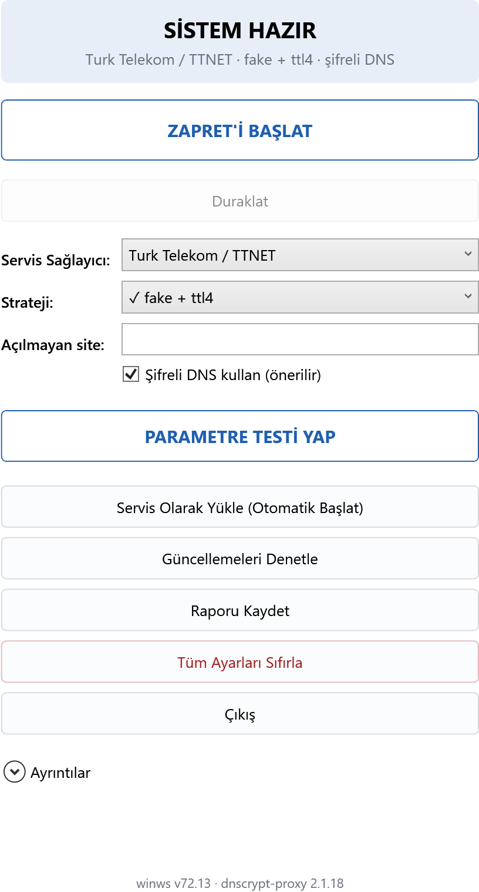

<div align="center">

# ZapretTR

**Türkiye'deki DPI engellemelerini aşan parametreyi sizin yerinize bulan Windows uygulaması.**

[zapret](https://github.com/bol-van/zapret) projesinin `winws` motoru üzerine kurulu bir arayüz.
Elle parametre denemek yerine, sizin hattınızda gerçekten neyin çalıştığını ölçerek buluyor.

[](https://github.com/superuser-d0/zapret-tr/releases/latest)
[](https://github.com/superuser-d0/zapret-tr/actions/workflows/ci.yml)
[](LICENSE)
[](https://github.com/superuser-d0/zapret-tr/releases/latest)

### [⬇ İndir](https://github.com/superuser-d0/zapret-tr/releases/latest) · [Kolay kullanım](#kolay-kullanım) · [Sık sorulanlar](#sık-sorulanlar)



</div>

---

## Amaç

Türkiye'de erişim engeli iki ayrı katmanda uygulanıyor: adres çözümlemesini bozan **DNS
yönlendirmesi** ve bağlantının içine bakıp sonlandıran **DPI** (derin paket incelemesi).
İkisini de aşmanın bilinen yolları var — ama hangi yolun işe yaradığı sabit değil.

Sebebi şu: her servis sağlayıcı kendi DPI donanımını kendi ayarlarıyla işletiyor. Bir hatta
bağlantıyı sıfırlayan kutu, başka bir hatta yalnızca ilk paketi süzüyor olabilir. Bu yüzden bir
sağlayıcıda çalışan parametre diğerinde hiçbir şey yapmayabilir. Aynı sağlayıcının farklı
hatlarında bile farklı sonuç çıkabiliyor: üç ayrı Türk Telekom hattında üç farklı davranış
ölçtük.

ZapretTR'in işi tam burada başlıyor: **doğru parametreyi tahmin etmek yerine ölçerek
kanıtlamak.** Uygulama, hattınız için bilinen adayları sırayla deniyor, her birini gerçekten
bağlantı kurarak sınıyor ve hangisinin işe yaradığını kanıtıyla birlikte söylüyor. Bir aday
ancak ölçümü geçtiyse "doğrulandı" etiketi alıyor.

Önceliğimiz, **henüz ölçemediğimiz hatlar**: Turkcell Superonline, TurkNet, Vodafone ve
diğerleri. Bu profillerde aday listemiz var ama tek bir doğrulanmış ölçümümüz yok, çünkü o
hatlara erişimimiz yok. [Aşağıdaki tabloda](#hangi-hatlarda-doğrulandı) hangi hattın eksik
olduğunu görebilirsiniz.

> **Bir dürüstlük notu:** "Şu sağlayıcıda engelleme daha ağır" gibi bir sıralama yapmıyoruz,
> çünkü elimizde bunu söyleyecek karşılaştırmalı ölçüm yok. Bildiğimiz tek şey, sağlayıcıların
> birbirinden farklı davrandığı ve bu farkın ölçülmesi gerektiği.

---

## Ne yapıyor

zapret ile çalışan bir parametre bulmanın alışıldık yolu `blockcheck.sh`: 10-40 dakika süren bir
tarama ve sonunda elinizde bir `.cmd` dosyasına yapıştırmanız gereken komut satırı. ZapretTR
bunu **iki düğmeye** indiriyor — hattınızı tespit ediyor, o hat için bilinen adayları sırayla
ölçüyor, çalışanı buluyor.

| | |
|---|---|
| **Otomatik sağlayıcı tespiti** | Hattınızı ASN üzerinden bulur; "Bilmiyorum" tam anlamıyla desteklenen bir seçenektir |
| **Ölçerek bulur** | Her aday gerçekten bağlantı kurularak sınanır, tahmin edilmez |
| **Bölüm bölüm arar** | `tcp80`, `tcp443`, `quic` ve `discord-voice` bağımsız aranıp birleştirilir |
| **Şifreli DNS** | Engelleme çoğu zaman iki katmanlı olduğu için DNS katmanı da aşılır |
| **Dokunmadığı yeri bozmaz** | Sorunu olmayan bölüme denenmemiş strateji uygulanmaz |
| **Ne bildiğini söyler** | Her aday "doğrulandı" ya da "doğrulanmadı" etiketiyle gelir |
| **Kendini günceller** | "Güncellemeleri Denetle" paketi indirir, SHA256 özetini doğrular, kurar |
| **Arka planda çalışır** | Pencereyi kapatmak korumayı kapatmaz; uygulama bildirim alanına iner |
| **Raporlanabilir** | "Raporu Kaydet" günlüğü ve ortam özetini tek dosyaya yazar |

> **Durum: çalışıyor.** Kurulum paketi indirilip gerçek bir makineye kuruldu ve normal bir
> kullanıcı gibi kullanıldı: parametre testi hattı tespit etti, çalışan stratejiyi buldu, Başlat'tan
> sonra engelli adresler açıldı. Doğrulama bağımsız bir istemciyle (`curl`) yapıldı — ölçüm
> motorunun kendi raporuyla değil. Şu an **25 aday** doğrulanmış durumda: 23'ü Türk Telekom
> (AS9121), 2'si Turkcell Mobil (AS16135) hattında.
>
> Eksik olan kod değil, **kapsam**. On profilin sekizinde henüz hiç saha verisi yok, çünkü o
> hatlara erişemiyoruz. **Testçi arıyoruz** — [hangi hatların eksik olduğu](#hangi-hatlarda-doğrulandı).

---

## Kolay kullanım

**1. İndirin.** [Releases](https://github.com/superuser-d0/zapret-tr/releases) sayfasından
`ZapretTR-Setup-<sürüm>.exe` dosyasını alın.

**2. Kurun.** Dosyaya çift tıklayın.

- Windows **"bilgisayarınızı korudu"** uyarısı verirse bu **beklenen bir durum**: paket imzalı
  değil, çünkü kod imzalama sertifikamız yok. "Ek bilgi" → "Yine de çalıştır".
- **Yönetici izni** ister. Gerekçesi, uygulamanın çekirdek modunda çalışan bir ağ sürücüsü
  kullanması.
- İndirdiğiniz dosyanın gerçekten bu yayından geldiğini doğrulamak isterseniz yayındaki
  `SHA256SUMS.txt` ile karşılaştırın:
  ```powershell
  Get-FileHash .\ZapretTR-Setup-<sürüm>.exe -Algorithm SHA256
  ```

**3. Üç adımda kullanın.**

| Adım | Ne yapacaksınız | Ne göreceksiniz |
|---|---|---|
| 1 | Hiçbir ayara dokunmayın | Servis sağlayıcı: **"Bilmiyorum / otomatik tespit et"**, Başlat kapalı |
| 2 | **PARAMETRE TESTİ YAP** | Hattınız tespit edilir, çalışan parametre aranır (**birkaç dakika**) |
| 3 | **ZAPRET'İ BAŞLAT** | Test bitince "STRATEJİ BULUNDU" yazar ve Başlat açılır |

Tamamı bu kadar. **"Şifreli DNS kullan" seçeneği işaretli kalsın**: engelleme çoğu zaman iki
katmanlı ve o kutu kapalıyken alttaki katman aşılamaz.

**Sizde açılmayan belirli bir adres varsa** "Açılmayan site" kutusuna yazın ve testi öyle
çalıştırın. Doğrusu da budur — kimin neye erişemediği kişiden kişiye değişiyor.

**Her açılışta çalışmasını istiyorsanız** "Servis Olarak Yükle" düğmesi bir Windows servisi
kurar. Bu durumda uygulamayı açmanız gerekmez ve **yeniden başlatmaya da gerek yok** —
servis hemen çalışmaya başlar, sonraki açılışlarda kendiliğinden devreye girer.

**Otomatik başlatmayı kaldırdıysanız** bilgisayarı bir kez yeniden başlatmanız iyi olur:
ağ sürücüsü çekirdekten hemen düşmüyor ve kalıntı bir sürücü, sonraki parametre testinde
bütün adayların aynı şekilde başarısız olmasına yol açabiliyor.

### Sık sorulanlar

**Test neden birkaç dakika sürüyor?** Her aday için gerçekten bağlantı kurulup ölçüldüğü için.
Sonuç kaydedilir; bir sonraki açılışta testi tekrarlamanız gerekmez.

**"ENGEL BULUNAMADI" yazarsa ne olur?** Test hedeflerinin hepsi zaten açılıyor demektir. Sizde
açılmayan adresi "Açılmayan site" kutusuna girip yeniden deneyin.

**Antivirüs uyarı verirse?** Paket yakalama sürücüsü ile imzasız derlemenin birleşimi
false-positive üretebiliyor. Windows Defender bu paketi işaretlemiyor (ölçtük); diğer ürünler
için garanti veremeyiz.

**İnternetim gitti, adresler çözülmüyor.** Uygulama şifreli DNS için sistem DNS'ini kendine
yönlendiriyor ve her çıkışta geri alıyor. Bir şekilde yarım kaldıysa şu komut geri alır:
```powershell
& "$env:ProgramFiles\ZapretTR\ZapretTR.exe" --uninstall-services
```
Program Ekle/Kaldır üzerinden kaldırmak da aynı temizliği yapıyor.

**Yeni sürüm çıkınca ne yapmam gerekiyor?** Hiçbir şey indirmenize gerek yok:
**"Güncellemeleri Denetle"** düğmesi yeni sürümü indirir, SHA256 özetini doğrular ve
kurulumu başlatır. Ayarlarınız ve doğrulanmış stratejileriniz korunur. Yeni sürüm
varsa uygulama açılışta zaten haber verir.

**Uygulama internete bir şey gönderiyor mu?** Ölçüm sonuçları, seçtiğiniz strateji ve
raporlar **yalnızca diske** yazılır. Dışarı yapılan tek istek güncelleme kontrolüdür:
açılışta GitHub'a "en son sürüm ne" diye sorulur. Gönderilen başka hiçbir şey yok —
ne hattınız, ne stratejiniz, ne ölçüm sonucunuz. İstemezseniz
`%ProgramData%\ZapretTR\config.json` içindeki `updateCheckEnabled` değerini `false`
yapın; uygulama o zaman hiçbir ağ isteği yapmaz.

**"SERVİS DURMUŞ" yazıyor, ne yapmalıyım?** Otomatik başlatma servisi kurulu ama
çalışmıyor demektir — koruma o anda kapalıdır. En sık sebebi, bir yükseltmeden sonra
servisin yeniden başlatılamamış olması. Üç seçeneğiniz var: **"ZAPRET'İ BAŞLAT"** ile
elle başlatın, **"Otomatik Başlatmayı Kaldır"** deyip yeniden kurun, ya da bilgisayarı
yeniden başlatın. Uygulama bu durumda Başlat düğmesini açık tutar; kilitli kalmazsınız.

### Bağlantı ya da ağ değiştirdiğinizde

**WiFi ile Ethernet arasında geçiş yaparsam yeniden test gerekir mi?** Aynı modeme bağlı
oldukları sürece **hayır**. DPI, evinizdeki bağlantı türünde değil servis sağlayıcının
ağında çalışıyor; kabloyla da WiFi ile de aynı sağlayıcıya, aynı DPI donanımına
çıkıyorsunuz. Ölçtük: aynı strateji (`fake + ttl4`) iki bağlantıda da Discord'u açtı ve
iki arayüzün ağ geçidi aynı çıktı — aynı IP, aynı MAC adresi, yani aynı modem.

Şifreli DNS tarafı da 0.1.9'dan itibaren her iki karta birden uygulanıyor, dolayısıyla
kabloyu takıp çıkarmak koruma durumunu değiştirmiyor.

Yeni test gerektiren şey bağlantı türü değil, **ağın kendisi**: telefonunuzun mobil
paylaşımına bağlanmak, başka bir eve ya da iş yerine gitmek. Orada farklı bir servis
sağlayıcı, dolayısıyla farklı bir DPI yapılandırması var; bir hatta çalışan parametre
orada işe yaramayabilir.

Bu durumda ne yapmanız gerektiği:

1. **Servis sağlayıcı** listesinden yeni hattı seçin (bilmiyorsanız "Bilmiyorum" seçeneği
   hattı kendisi tespit eder).
2. **Strateji** listesi o sağlayıcının adaylarıyla dolar. Daha önce o hatta test
   yaptıysanız sonucunuz kaydedilmiştir ve listenin en üstünde `✓` işaretiyle çıkar;
   onu seçip doğrudan Başlat'a basabilirsiniz, testi tekrarlamanız gerekmez.
3. O hatta hiç test yapmadıysanız **Parametre Testi**'ni bir kez çalıştırın. Sonuç
   kaydedilir ve bir dahaki sefere listede hazır bekler.

Kaydedilmiş bir strateji zamanla işlevini yitirebilir — sağlayıcı DPI yapılandırmasını
güncellerse dün çalışan parametre bugün çalışmaz. Uygulama bunu kendisi fark ediyor:
başlattıktan birkaç saniye sonra hedefleri ölçüyor ve hiçbiri açılmıyorsa **"ÇALIŞIYOR —
AMA AÇMIYOR"** diyerek yeni bir parametre testi öneriyor.

### Discord

### Pencereyi kapatınca ne oluyor

**X düğmesi korumayı kapatmaz.** Uygulama saat yanındaki bildirim alanına iner;
`winws` ve şifreli DNS çalışmaya devam eder. Pencereyi geri getirmek için simgeye
çift tıklayın.

**Tamamen kapatmak için Çıkış düğmesini** kullanın (ya da simgeye sağ tıklayıp
Çıkış). O yol koruma açıksa `winws`i durdurur ve sistem DNS ayarını geri alır.

Otomatik başlatma servisi kuruluysa uygulamayı kapatmanız zaten korumayı etkilemez:
servis bağımsız çalışır.

**Discord'da sesli görüşme çalışıyor mu?** Evet. Türk Telekom hattında gerçek kullanımda
denendi: **sesli görüşme de ekran paylaşımı da çalıştı.** Ekran paylaşımının ayrıca anlamı var,
çünkü sesten çok daha ağır bir medya akışı.

Mekanizması şöyle: o hatta ses zaten engelli değil; metin ve bağlantı engeli aşılınca ses
kendiliğinden kuruluyor. ZapretTR ses trafiğine **hiç dokunmuyor**, çünkü "sorunu olmayan bölüme
dokunma" kuralı gereği o bölüm komuta hiç girmiyor.

Sizde ses **çalışmıyorsa** dürüst cevap şu: o durum için doğrulanmış bir stratejimiz yok ve araç
size denenmemiş bir şey uygulamaz. Sebebi teknik — Discord'un ses yolu kendi IP keşif
protokolünü kullanıyor ve sunucu adresi ancak kimlik doğrulaması yapılmış bir ses oturumundan
alınabiliyor. Dolayısıyla dışarıdan ölçemiyoruz.

---

## Neden var

zapret güçlü bir anti-DPI aracı, ama Windows'ta son kullanıcı için pratikte kullanılabilir
değil. Çalışan bir strateji bulmanın tek yolu `blockcheck.sh`: cygwin üzerinde çalışan ve
desync metodu × TTL × split pozisyonu × fooling kombinasyonlarını **tek tek, sırayla** deneyen
bir bash betiği. Tam bir tarama tipik olarak 10-40 dakika sürüyor ve sonunda elinizde kalan şey,
bir `.cmd` dosyasına elle yapıştırmanız gereken bir komut satırı oluyor.

## Yaklaşım

ZapretTR aramayı **sıralama yaparak** kısaltıyor. Bir sağlayıcının DPI kutusu tutarlı davrandığı
için, o sağlayıcıda daha önce çalıştığı bilinen adaylar önce deneniyor:

| Aşama | Kapsam | Tipik süre |
|---|---|---|
| Tier 1 | Seçilen sağlayıcının profili (5-19 aday) | saniyeler |
| Tier 2 | Komşu TR profilleri | 1-2 dakika |
| Tier 3 | Genel kombinatoryal arama (221 aday) | dakikalar |

Kullanıcı sağlayıcısını bilmiyorsa ASN ve kuruluş adından otomatik tespit ediliyor.

Genel aramada sıra **aileler arasında dolaşıyor**: önce her strateji ailesinden birer aday
deneniyor, sonra derinleşiliyor. Aksi halde tek bir ailenin onlarca varyantı bütçeyi tüketiyor
ve hiç denenmemiş mekanizmalara sıra gelmiyordu — ölçtüğümüz bir kullanıcıda tam olarak bu oldu.

### Çalışan strateji tek bir parametre değildir

Tasarımın merkezinde şu gözlem var: `--dpi-desync-fooling=md5sig` yalnızca hedef sunucu TCP MD5
seçeneğini reddettiğinde işe yarıyor. Yani **çalışan strateji, sağlayıcının olduğu kadar hedef
sunucunun da fonksiyonu** — aynı bağlantıda Discord'u açan parametre YouTube'u açmayabilir.

Bu, doğrulanmış adayların ne kadar genellenebildiğini de bir soru haline getiriyordu:
hedeflerimizin çoğu Cloudflare arkasında olduğu için "doğrulandı" damgası yalnızca tek bir
sunucu ailesini yansıtıyor olabilirdi. TTNET hattında ölçtük ve öyle olmadığını gördük — aynı
strateji, farklı barındırıcılarda da gerçek sunucuya ulaştırıyor:

| Hedef | Barındıran | Koruma açıkken |
|---|---|---|
| discord.com | Cloudflare | HTTP 200 |
| pornhub.com | Cloudflare **değil** | HTTP 301 |
| xvideos.com | Cloudflare **değil** | HTTP 301 |
| www.youtube.com | Google (engelli değil) | HTTP 200 — etkilenmedi |

Hedef listesi bu yüzden dar, ama **keyfî değil**: bir hedef ancak yeni bilgi veriyorsa
ekleniyor. "Barındırıcıya göre değişiyor mu" sorusu yukarıdaki ölçümle cevaplandığı için genel
site listesi büyütülmedi. Buna karşılık `updates.discord.com` eklendi, çünkü Discord istemcisi
güncelleme için oraya gidiyor; o adres açılmadığında uygulama güncelleme ekranında takılı
kalıyor, test ise "başarılı" diyordu.

Adaylar bu nedenle bölümlere ayrılmış durumda (`tcp80`, `tcp443`, `quic`, `discord-voice`). Her
bölüm bağımsız test edilip kendi kazananını buluyor, nihai komut da bölümleri `--new` ile
birleştiriyor — upstream'in kendi `preset1_example.cmd` dosyasıyla aynı yapı.

### Her parametrenin kaynağı belli

Her adayın nereden geldiği etiketli:

| Etiket | Anlamı |
|---|---|
| `verified` | Bizim saha testimizde gerçekten çalıştı |
| `community-unverified` | TR topluluğunda bildirilmiş, biz doğrulamadık |
| `hypothesis` | Belgelenen mekanizmadan türetildi; kimse bildirmedi, biz çıkardık |
| `upstream-preset` | zapret'in kendi örnek preset dosyasından geldi |

Bu ayrım kozmetik değil. "Bu profil henüz doğrulanmadı" demekle "bu çalışıyor" demek arasındaki
farkı korumak için var.

---

## Hangi hatlarda doğrulandı

"Doğrulandı" burada dar bir anlam taşıyor: **gerçek bir hatta, ölçümle** — aynı komut üç bağımsız
koşumda 3/3 geçtiyse. Toplulukta bildirilmiş ya da mekanizmadan türetilmiş şeyler sayılmıyor.
Kullanıcıdan gelen olumlu geri bildirim de ayrı tutuluyor: değerli, ama ölçüm değil.

| Servis sağlayıcı | tcp80 | tcp443 | QUIC | Durum |
|---|:---:|:---:|:---:|---|
| Türk Telekom (AS9121) | 6 | 10 | 7 | ✅ doğrulandı (ölçüm) — üç ayrı kullanıcıda çalıştı |
| Turkcell Mobil (AS16135) | — | 1 | 1 | ✅ doğrulandı (ölçüm) · ⚠️ bir hatta tcp80/QUIC açılamadı |
| Türksat Kablonet | — | — | — | 🟡 **kullanıcı bildirimi** — bağlantı kuruldu ve giriş yapıldı (0.1.6) |
| Turkcell Superonline | — | — | — | ⬜ **testçi aranıyor** |
| TurkNet | — | — | — | ⬜ **testçi aranıyor** |
| Vodafone (sabit / mobil) | — | — | — | ⬜ **testçi aranıyor** |
| Millenicom · NetSpeed · TT Mobil | — | — | — | ⬜ **testçi aranıyor** |

⚠️ **Turkcell Mobil — negatif bir ölçüm de kaydediyoruz.** Bir hatta 49 aday denendi ve
hiçbiri `tcp80` ile QUIC bölümünü açamadı; motor düzgün çalışıyordu, bağlantılar gerçekten
sıfırlanıyordu. **Ama aynı hatta `tcp443` tamamen açıktı** (`discord.com`,
`gateway.discord.gg`, `updates.discord.com` hepsi erişilebilir) — yani Discord'un ana
trafiği zaten geçiyordu.

Bu, uygulamanın "çalışan strateji bulunamadı" demesinin her zaman "araç işe yaramadı"
anlamına gelmediğini gösteriyor: engelli bölümler ikincil olabiliyor. Negatif sonuçlar da
veri, o yüzden burada duruyor.

🟡 **Türksat Kablonet:** bir kullanıcı 0.1.6 ile bağlantı kurabildiğini ve giriş yapabildiğini
bildirdi. Profil hâlâ `verified` değil, çünkü hangi adayın kazandığını ve sonucun tekrarlanıp
tekrarlanmadığını bilmiyoruz. O hattaysanız ve testi çalıştırdıysanız, uygulamadaki
**"Ayrıntılar"** günlüğünü paylaşmanız bu profili doğrulanmışa çevirecek tek şey.

Bu hatlardan birindeyseniz yapmanız gereken tek şey var: uygulamayı kurup **Parametre Testi**'ni
çalıştırmak ve sonucu [bir issue'da](https://github.com/superuser-d0/zapret-tr/issues)
paylaşmak. Test hiçbir yere veri göndermiyor; neyi paylaşacağınıza siz karar
veriyorsunuz.

Aynı sağlayıcı içinde bile davranış değişebiliyor: üç ayrı Türk Telekom hattında üç farklı sonuç
aldık (birinde düz HTTP engelliydi, diğerinde değildi). Yani "profil var" demek "sizde çalışır"
demek değil — ölçüm tam olarak bunun için var.

---

## Saha testi paketi kimin için

Yayınlarda `zapret-tr-saha-testi.zip` diye ikinci bir dosya var. **Son kullanıcı için değil** ve
internetinizi açmaz: koruma sağlamaz, arka planda çalışmaz, bilgisayar açılışında devreye
girmez. Yaptığı tek şey ölçmek — hangi parametrenin o hatta işe yaradığını bulup bir rapor
dosyasına yazmak.

Var oluş sebebi, henüz ölçemediğimiz hatlarda (başka bir sağlayıcı, başka bir şehir)
engellemenin nasıl davrandığını öğrenmek. Kurulum yapmıyor, `--cleanup` ile kendini temizliyor
ve raporu hiçbir yere göndermiyor; yalnızca diske yazıyor. Yardım etmek isterseniz raporu bize
iletebilirsiniz.

Kendi internetinizi açmak istiyorsanız ihtiyacınız olan dosya bu değil,
`ZapretTR-Setup-<sürüm>.exe`.

---

## Kurulum (geliştirme)

Gereksinimler: .NET 8 SDK, PowerShell, Windows x64.

```bash
powershell -ExecutionPolicy Bypass -File tools/fetch-upstream.ps1
```

Bu komut `winws.exe` ile WinDivert sürücüsünü sabitlenmiş bir upstream sürümünden indiriyor ve
SHA256 ile doğruluyor. `vendor/` klasörü git'e girmiyor.

```bash
dotnet build
dotnet test
```

Sıra önemli: arayüz duman testleri `vendor/` içindeki ikilileri aradığı için,
`fetch-upstream.ps1` çalıştırılmadan `dotnet test` iki testte başarısız olur.

## Depo yapısı

```
src/ZapretTr.Core/             winws süreç yönetimi, komut kurma, profil yükleme
src/ZapretTr.Prober/           parametre test motoru (blockcheck.sh'ın yerini alır)
src/ZapretTr.Prober.Cli/       saha testi için taşınabilir tek dosyalık araç
src/ZapretTr.App/              WPF arayüz
profiles/isp/*.json            sağlayıcı başına sıralı aday listesi
profiles/generic-ladder.json   Tier 3 kombinatoryal arama tarifi
tools/fetch-upstream.ps1       upstream ikili indirme + SHA256 doğrulama
```

## Yol haritası

Tamamlananlar:

- [x] Depo iskeleti, upstream indirme + SHA256 doğrulama
- [x] Sağlayıcı profil veritabanı (10 profil) + genel kombinatoryal merdiven (221 aday)
- [x] Komut kurucu, profil yükleyici, testler (151 test)
- [x] winws süreç yönetimi + WinDivert temizliği
- [x] Test motoru: baseline tarama, protokol sınıfı testleri, BTK engel sayfası tespiti
- [x] WPF arayüz (Başlat / Duraklat / Çıkış / Parametre Testi / Sıfırla)
- [x] Gerçek donanımda uçtan uca doğrulama — TTNET'te Discord, Pornhub, XVideos açıldı
- [x] `--ipset-ip` izolasyonunun çalıştığı doğrulandı (winws `--debug=1` çıktısıyla)
- [x] Şifreli DNS (dnscrypt-proxy) + her çıkış yolunda geri alma
- [x] Taşınabilir saha testi paketi (kurulum yapmaz, kendini temizler)
- [x] Kalıcılık: seçimler ve öğrenilen doğrulamalar `%ProgramData%\ZapretTR\` altında
- [x] Otomatik başlatma: `ZapretTR` ve `ZapretTR-DNS` Windows servisleri
- [x] Servis kaldırma yolu gerçek koşumda doğrulandı
- [x] Şifreli DNS bağlı olmayan kartlara da uygulanıyor — kablo/WiFi geçişinde koruma
      yarım kalmıyor (gerçek makinede ölçüldü)
- [x] ASN otomatik tespiti — "Bilmiyorum" artık çalışıyor
- [x] Kurulum paketi (Inno Setup, kendi kendine yeten) — tam yaşam döngüsü koşuldu
- [x] Paralel hedef sınaması
- [x] Discord ses (UDP/STUN) ölçümü — bölüm artık sessiz değil
- [x] **QUIC.** Hem ölçüm yolu hem çalışan strateji bulundu. Uzun süre "engelli" sanılan şeyin
      bir kısmı bizim ölçüm hatamızmış; ayrıntısı `docs/DEVAM.md` dosyasında.
- [x] **Kurulum testi CI'da.** Paket gerçekten kuruluyor, servis kurduruluyor, üzerine
      yükseltme yapılıp servisin sağ kalıp kalmadığına bakılıyor, sonra kaldırılıyor.
      Düzeltme geri alınarak testin hatayı gerçekten yakaladığı kanıtlandı.
- [x] **Teşhis kanalı.** "Raporu Kaydet" düğmesi ve saha paketinin her yolda rapor
      bırakması — hata durumunda ve engel bulunamadığında da.
- [x] **Tek tıkla güncelleme.** Paketi indirir, SHA256 özetini doğrular, kurulumu başlatır.
- [x] **Bildirim alanı simgesi.** Pencereyi kapatmak korumayı kapatmıyor.
- [x] **Paket boyutu.** `PublishTrimmed` açık ve güvenli: bütün JSON yolları kaynak üretimine
      taşındı, kırpma analizörü hata verecek şekilde açık. 34.3 → 12.5 MB.

Kalanlar:

- [ ] **Doğrulama kapsamı — asıl eksik bu.** Yukarıdaki tabloya bakın: on profilin sekizinde
      sıfır saha verisi var. Kod eksiği değil, o hatlara erişim eksiği.
- [ ] **`discord-voice` hiçbir profilde doğrulanmadı ve dışarıdan doğrulanamıyor.** Discord'un
      ses yolu kendi IP keşif protokolünü kullanıyor; sunucu adresi ancak kimlik doğrulaması
      yapılmış bir ses oturumundan alınabiliyor. Genel STUN engellenmediği için vekil bir
      hedefle de ölçülemiyor. (`tcp80` artık doğrulandı — eksik olan şey hattın temizliği değil,
      hedef listesinde engelli bir tcp80 adresinin bulunmamasıydı.)
- [ ] **Kurulumdan sonra takılan yeni ağ adaptörü.** Şifreli DNS, kurulum sırasında makinede
      bulunan Ethernet ve WiFi kartlarına uygulanıyor. Sonradan takılan bir adaptör (örneğin USB
      WiFi) kapsam dışında kalıyor; onun için uygulamayı açıp servisi bir kez yeniden kurmak
      gerekiyor.
- [ ] **Kod imzalama sertifikası yok.** Defender bu paketi işaretlemiyor (ölçtük), ama
      SmartScreen "bilinmeyen yayımcı" uyarısı verecek. Sertifika alınana kadar kullanıcının
      elindeki tek doğrulama aracı yayındaki SHA256 özetleri.
- [ ] **`--dns test` bir makinede geçmiyordu, orada yeniden üretilemedi.** Başka bir makinede
      hem sıcak hem soğuk başlangıçta sorunsuz geçti. Güvenli tarafa düşüyor (sistem DNS'ine
      dokunmuyor, temiz geri alıyor); tekrar görülürse sebebini söylemesi için hata mesajı artık
      süreç ve port durumunu taşıyor.

## Yayın ve sürüm

Sürüm tek bir kaynaktan geliyor: git tag'i. `Directory.Build.props` derlenen exe'lerin sürümünü,
`installer/setup.iss` kurulum paketininkini taşıyor; ikisi de yayın akışında tag'den besleniyor
(`-p:Version=`, `/DAppVersion=`).

- `.github/workflows/ci.yml` — her itmede upstream indirme, derleme, testler, kırpılmış yayın
  (kırpma analizörü hata verirse burada patlar) ve `msquic.dll` kontrolü.
- `.github/workflows/release.yml` — `v*` tag'i itildiğinde kurulum paketini, saha testi paketini
  ve `SHA256SUMS.txt` dosyasını üretip **taslak** yayın açar.

Yayın notu CHANGELOG'dan üretiliyor; o sürümün bölümü yazılmamışsa yayın akışı başarısız oluyor.
Yayının taslak açılması da kasıtlı: imzasız ikili dağıtıldığı için son bir gözden geçirme
yapılıyor.

Bütün değişiklikler [CHANGELOG.md](CHANGELOG.md) dosyasında.

## Uyarılar

**Yönetici yetkisi zorunlu.** `winws.exe` çekirdek modunda çalışan WinDivert sürücüsünü kullanıyor
ve `--help` için bile yükseltilmiş yetki istiyor.

**Antivirüs uyarı verebilir.** Paket yakalama sürücüsü ile imzasız derlemenin birleşimi
false-positive üretiyor. Kod imzalama sertifikamız yok.

## Teşekkür — Zapret Win TR

**Zapret Win TR** geliştiricisi **Ali Mali**, kendi aracındaki hazır sağlayıcı stratejilerini
kullanmamıza izin verdi ve kaynağını paylaştı.

Karşılaştırdık ve sonuç ilginç çıktı: klasik winws motoru için tanımladığı **sekiz stratejinin
sekizi de bizim profillerimizde zaten vardı**, üstelik altısında onun tercihi bizim de ilk
adayımızdı. Kalan ikisi bizde ikinci sırada — onun arayüzünde de adları "Alternatif". Yani
buradan kopyalanmış bir parametre **yok**; birbirinden bağımsız iki proje aynı değerlere varmış.

Bunu ayrıca yazıyoruz, çünkü o profillerin tohumlarına duyulacak güveni doğrudan etkiliyor:
artık "toplulukta biri söylemiş" değil, gerçek kullanıcıları olan ayrı bir aracın gönderdiği
değerlerle örtüşen bir liste. (Yine de `verified` değiller — dayanak "olumsuz dönüş olmadı" ve
sessizlik ölçüm sayılmaz.)

Kaynağından **öğrendiğimiz ve uyguladığımız** iki şey var, ikisi de 0.1.6'da:

- WinDivert sürücüsünün yalnızca `windivert` adıyla değil, **`WinDivert14`** (GoodbyeDPI'ın da
  kullandığı ad) ve **`monkey`** adlarıyla da geride kalabildiği. Temizliğimiz eskiden yalnızca
  ilkini söküyordu; kalıntı bir servis ise bütün adayların aynı şekilde başarısız olmasına yol
  açabiliyordu.
- Aynı anda çalışan başka bir DPI atlatma aracının (özellikle **GoodbyeDPI**) ölçümü tümüyle
  geçersiz kıldığı ve bunun kullanıcıya söylenmesi gerektiği.

Bunlar fikir düzeyinde katkılar; kod bize ait. Ayrıntı için:
[THIRD-PARTY-NOTICES.md](THIRD-PARTY-NOTICES.md).

## Lisans

MIT — bkz. [LICENSE](LICENSE).

Bu bir **türev üründür**. DPI atlatma işini zapret'in `winws` motoru yapıyor; ZapretTR onu yöneten
arayüz ve otomatik parametre bulma katmanı. Üçüncü taraf bileşenler ve yükümlülükler için
[THIRD-PARTY-NOTICES.md](THIRD-PARTY-NOTICES.md).
